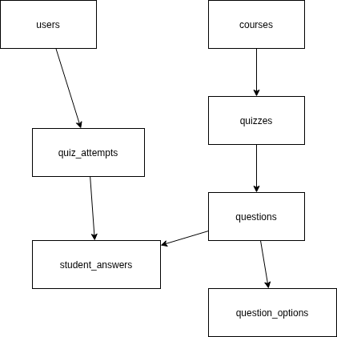

# LMS Quiz Module - Backend API

> Technical Assessment untuk posisi Backend Developer/DBA di Universitas Siber Asia

[](https://golang.org)
[](https://www.microsoft.com/sql-server)
[](LICENSE)

---

## 📋 Deskripsi

Sistem backend untuk modul kuis pada Learning Management System (LMS) dengan fitur:

- ✅ 3 tipe soal (Multiple Choice, Essay, File Upload)
- ✅ **Hybrid Grading System** (Auto-grading & Manual grading)
- ✅ Time limit & retake limit
- ✅ Quiz history tracking
- ✅ RESTful API dengan Golang
- ✅ Database ternormalisasi (3NF)
- ✅ Stored Procedures untuk business logic

---

## 🛠️ Tech Stack

| Technology | Version | Purpose |
|------------|---------|---------|
| **Go** | 1.21+ | Backend Language |
| **Gin** | Latest | Web Framework |
| **SQL Server** | 2019+ | Database |
| **sqlx** | Latest | SQL Extensions |
| **godotenv** | Latest | Environment Variables |

---

## 📁 Struktur Project

```
go-quiz-lms-siber-asia/
├── cmd/api/main.go              # Entry point
├── internal/
│   ├── app/                     # Application layer
│   ├── domain/                  # Domain models
│   ├── repository/              # Data access layer
│   ├── service/                 # Business logic
│   ├── handler/                 # HTTP handlers
│   └── middleware/              # HTTP middlewares
├── pkg/                         # Public utilities
├── config/                      # Configuration
├── database/                    # Database files
│   ├── migrations/              # DDL scripts
│   ├── erd/                     # ERD diagram
│   └── queries/                 # SQL queries
├── docs/                        # Documentation
├── scripts/                     # Utility scripts
├── .env.example                 # Environment template
├── Makefile                     # Build commands
└── README.md                    # This file
```

---

## 🚀 Quick Start

### Prerequisites

- **Go 1.21+** ([Download](https://golang.org/dl/))
- **SQL Server 2019+** ([Download](https://www.microsoft.com/sql-server/sql-server-downloads))
- **sqlcmd** (SQL Server command-line tools)
- **Git**

### 1. Clone Repository

```bash
git clone https://github.com/yourusername/go-quiz-lms-siber-asia.git
cd go-quiz-lms-siber-asia
```

### 2. Setup Environment

```bash
# Copy environment template
cp .env.example .env

# Edit .env dengan database credentials kamu
nano .env
```

**File `.env`:**
```env
DB_HOST=localhost
DB_PORT=1433
DB_USER=sa
DB_PASSWORD=YourStrongPassword123!
DB_NAME=LMS_QuizModule

SERVER_PORT=8081
SERVER_ENV=development
```

### 3. Install Dependencies

```bash
go mod download
# atau
make deps
```

### 4. Setup Database

```bash
# Otomatis dengan script
make db-setup

# Atau manual
bash scripts/setup_db.sh
```

Script akan:
1. Membuat database dan tabel
2. Membuat stored procedures
3. Insert sample data (optional)

### 5. Run Application

```bash
# Menggunakan make
make run

# Atau langsung dengan go
go run cmd/api/main.go
```

Server akan berjalan di: **http://localhost:8081**

---

## 📚 API Documentation

### Base URL
```
http://localhost:8081/api/v1
```

### Endpoints

| Method | Endpoint | Description |
|--------|----------|-------------|
| `GET` | `/health` | Health check |
| `POST` | `/quiz/:quiz_id/start` | Start quiz |
| `POST` | `/quiz/attempt/:attempt_id/answer` | Submit answer |
| `POST` | `/quiz/attempt/:attempt_id/submit` | Submit quiz |
| `GET` | `/quiz/attempt/:attempt_id/result` | Get result |
| `GET` | `/student/:user_id/quiz-history` | Get history |

### Example Request

**Start Quiz:**
```bash
curl -X POST http://localhost:8081/api/v1/quiz/1/start \
  -H "Content-Type: application/json" \
  -d '{"user_id": 1}'
```

**Response:**
```json
{
  "success": true,
  "message": "Quiz started successfully",
  "data": {
    "attempt_id": 1,
    "quiz_id": 1,
    "start_time": "2024-01-29T10:00:00Z",
    "time_limit_minutes": 60,
    "questions": [...]
  }
}
```

📖 **Full API Documentation:** [docs/API.md](docs/API.md)

---

## 🗄️ Database Schema

### ERD Diagram



### Tables

1. **users** - Data mahasiswa & dosen
2. **courses** - Data mata kuliah
3. **quizzes** - Data kuis
4. **questions** - Data soal
5. **question_options** - Pilihan jawaban (multiple choice)
6. **quiz_attempts** - Percobaan pengerjaan kuis
7. **student_answers** - Jawaban mahasiswa

### Stored Procedures

1. **sp_GetStudentQuizHistory** - Riwayat kuis mahasiswa
2. **sp_StartQuizAttempt** - Validasi & start quiz attempt
3. **sp_CalculateQuizScore** - Hitung total score
4. **sp_GetQuizStatistics** - Statistik quiz (untuk dosen)

📖 **Full Database Documentation:** [docs/DATABASE.md](docs/DATABASE.md)

---

## 🔄 Hybrid Grading Logic

### Cara Kerja

```
┌─────────────────┐
│ Student Submits │
│     Answer      │
└────────┬────────┘
         │
    ┌────┴────┐
    │Question │
    │  Type?  │
    └────┬────┘
         │
    ┌────┴──────────────┐
    │                   │
    ▼                   ▼
Multiple Choice    Essay/File Upload
    │                   │
    ▼                   ▼
Auto-Graded      Waiting Assessment
(Immediately)    (Manual by Instructor)
```

### Status Flow

- **in_progress** → Mahasiswa sedang mengerjakan
- **submitted** → Ada soal yang menunggu penilaian manual
- **graded** → Semua soal sudah dinilai, final score tersedia

📖 **Full Grading Logic Documentation:** [docs/HYBRID_GRADING_LOGIC.md](docs/HYBRID_GRADING_LOGIC.md)

---

## 🏗️ Architecture

### Clean Architecture (Layered)

```
HTTP → Handler → Service → Repository → Database
```

**Handler:** Parse request, format response
**Service:** Business logic, validation
**Repository:** Database queries, CRUD
**Database:** Data storage

📖 **Full Architecture Documentation:** [docs/ARCHITECTURE.md](docs/ARCHITECTURE.md)

---

## 🔧 Development

### Available Commands

```bash
make help          # Show all commands
make run           # Run application
make build         # Build binary
make test          # Run tests
make fmt           # Format code
make db-setup      # Setup database
make db-migrate    # Run migrations
make db-reset      # Reset database
make clean         # Clean build files
```

### Development with Live Reload

```bash
# Install air
go install github.com/cosmtrek/air@latest

# Run with live reload
make dev
```

---

## 🧪 Testing

### Run Tests

```bash
# All tests
make test

# Specific package
go test ./internal/service/...

# With coverage
go test -cover ./...
```

### Test Data

Sample data tersedia di `database/migrations/003_seed_data.sql`:
- 5 users (3 students, 2 instructors)
- 3 courses
- 3 quizzes
- Multiple questions dengan berbagai tipe

---

## 📊 Database Migration

### Manual Migration

```bash
# Setup database dari awal
sqlcmd -S localhost -U sa -P YourPassword -i database/migrations/001_create_tables.sql
sqlcmd -S localhost -U sa -P YourPassword -d LMS_QuizModule -i database/migrations/002_create_stored_procedures.sql
sqlcmd -S localhost -U sa -P YourPassword -d LMS_QuizModule -i database/migrations/003_seed_data.sql
```

### Using Scripts

```bash
# Setup lengkap
bash scripts/setup_db.sh

# Run migrations saja
bash scripts/run_migrations.sh
```

---

## 🔐 Security

### Implemented

✅ **SQL Injection Prevention** - Parameterized queries
✅ **Input Validation** - Request validation dengan validator
✅ **Error Handling** - Generic error messages untuk user
✅ **CORS** - Cross-origin resource sharing enabled

### Recommendations for Production

- [ ] Add JWT authentication
- [ ] Add rate limiting
- [ ] Add request logging
- [ ] Add HTTPS/TLS
- [ ] Add API key authentication

---

## 📈 Performance

### Optimizations

- Database indexes pada foreign keys
- Connection pooling (25 max open connections)
- Prepared statements untuk queries
- Efficient query design

### Load Testing (Future)

```bash
# Install hey
go install github.com/rakyll/hey@latest

# Test endpoint
hey -n 1000 -c 10 http://localhost:8081/api/v1/quiz/1/start
```

---

## 🐛 Troubleshooting

### Database Connection Error

```
Error: Cannot connect to database
```

**Solution:**
1. Check SQL Server is running: `sqlcmd -S localhost -U sa -P YourPassword`
2. Verify credentials di `.env` file
3. Check firewall settings

### Port Already in Use

```
Error: bind: address already in use
```

**Solution:**
```bash
# Find process using port 8081
lsof -i :8081

# Kill process
kill -9 <PID>
```

### Migration Failed

```
Error: Migration failed
```

**Solution:**
1. Check database exists: `sqlcmd -Q "SELECT name FROM sys.databases"`
2. Reset database: `make db-reset`
3. Run migrations manually

---

## 📝 TODO / Future Enhancements

### Phase 2
- [ ] File upload functionality (AWS S3/MinIO)
- [ ] Email notifications
- [ ] Real-time quiz monitoring (WebSocket)
- [ ] Caching layer (Redis)
- [ ] Instructor grading interface

### Phase 3
- [ ] Microservices architecture
- [ ] Message queue (RabbitMQ)
- [ ] API Gateway
- [ ] Containerization (Docker/Kubernetes)

---

## 👨‍💻 Author

**[Your Name]**
- Email: your.email@example.com
- GitHub: [@yourusername](https://github.com/yourusername)
- LinkedIn: [Your LinkedIn](https://linkedin.com/in/yourprofile)

---

## 📄 License

This project is licensed under the MIT License - see the [LICENSE](LICENSE) file for details.

---

## 🙏 Acknowledgments

- Universitas Siber Asia - Technical Assessment
- Clean Architecture by Robert C. Martin
- Go Standard Project Layout
- Gin Web Framework Community

---

## 📞 Support

Jika ada pertanyaan atau issue:

1. **Email:** your.email@example.com
2. **GitHub Issues:** [Create Issue](https://github.com/yourusername/go-quiz-lms-siber-asia/issues)
3. **Documentation:** Check [docs/](docs/) folder

---

**Made with ❤️ for Universitas Siber Asia Technical Assessment**